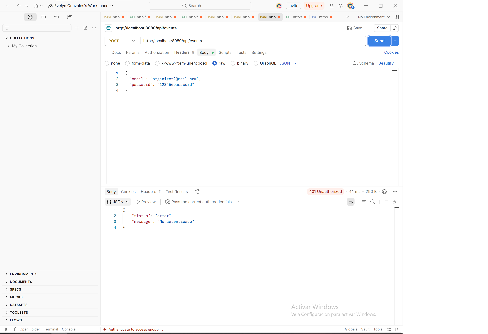
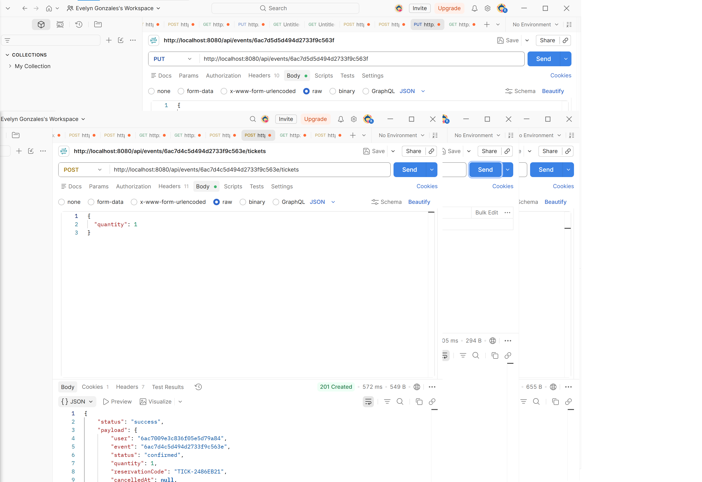
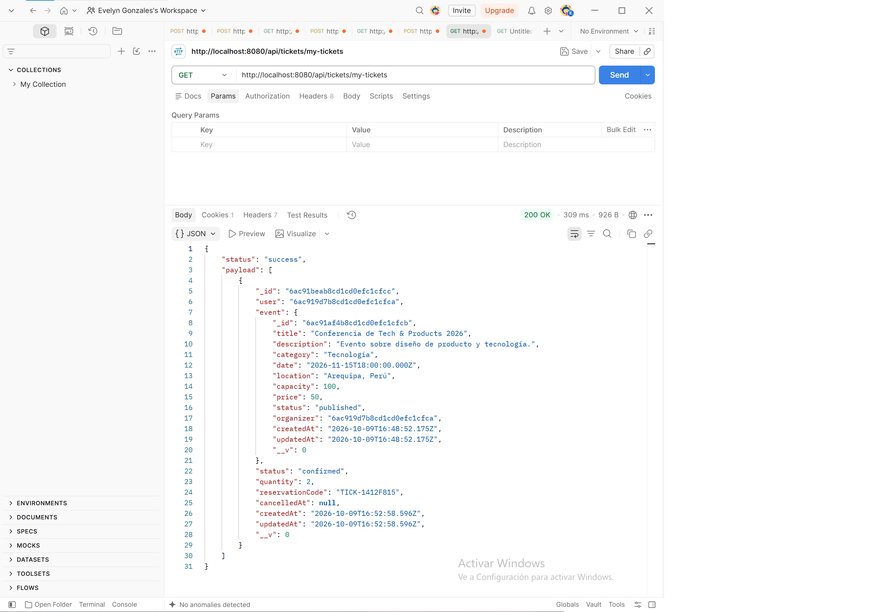
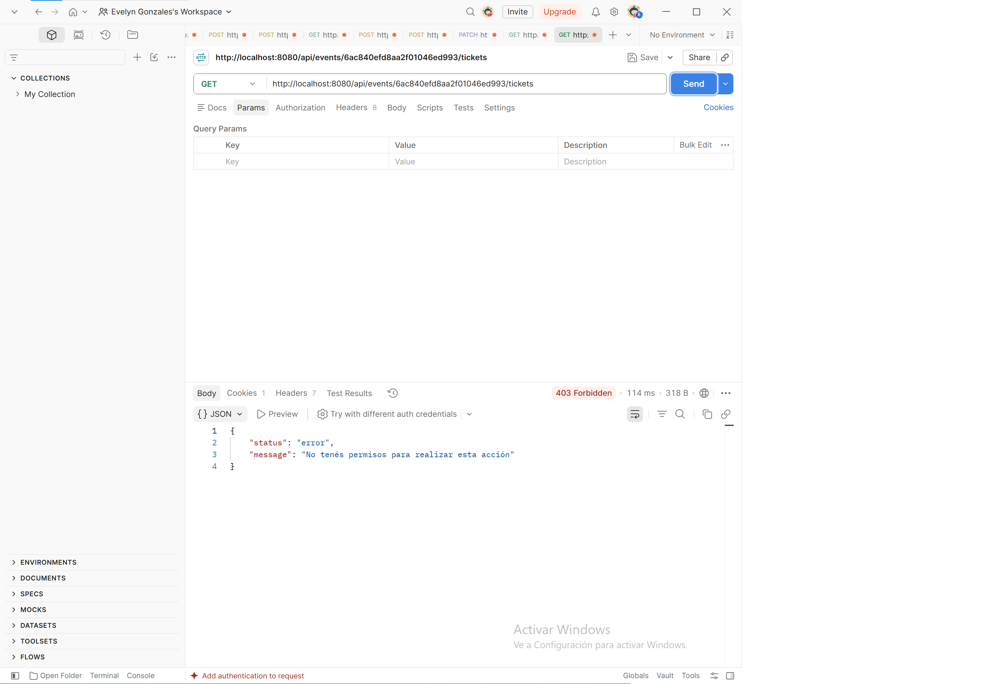
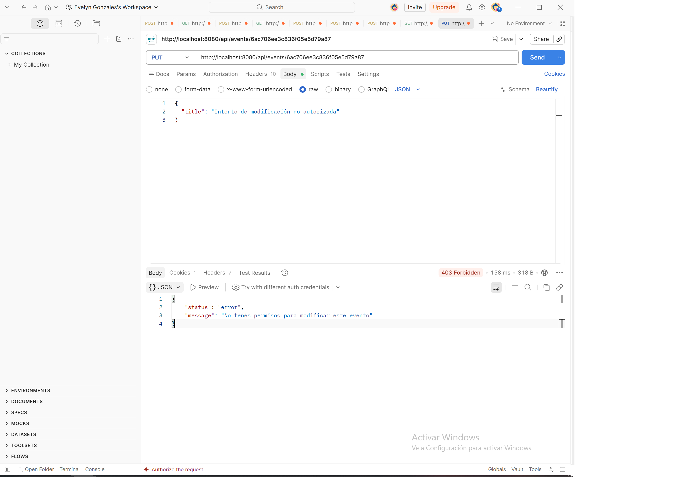

# Pre-entrega 5: Roles y Autorización (Backend II)

Este proyecto implementa control de acceso basado en roles (RBAC) y autorización sobre recursos para la gestión de usuarios y eventos.

---

## 1. Matriz de Permisos por Rol

| Rol | `/api/sessions` | `POST /api/events` (Crear) | `PUT /api/events/:id` (Editar) | `GET /api/users` (Listar usuarios) |
|---|---|---|---|---|
| **Invitado / Sin Sesión** | Registrar / Login | ❌ (401 Unauthorized) | ❌ (401 Unauthorized) | ❌ (401 Unauthorized) |
| **`user`** | Autenticado | ❌ (403 Forbidden) | ❌ (403 Forbidden) | ❌ (403 Forbidden) |
| **`organizer`** | Autenticado | ✅ (201 Created) | ✅ Solo si es CREADOR del evento (403 si es ajeno) | ❌ (403 Forbidden) |
| **`admin`** | Autenticado | ✅ (201 Created) | ✅ Cualquier evento | ✅ (200 OK) |

---

## 2. Diferencia entre Errores 401 y 403

* **`401 Unauthorized` (Autenticación requerida):** 
  Indica que la solicitud carece de credenciales válidas o que la sesión (JWT/Cookie) no existe o ha expirado. El servidor desconoce la identidad del cliente.
* **`403 Forbidden` (Autorización denegada):** 
  Indica que el servidor reconoce la identidad del cliente autenticado, pero este **no posee el rol ni los permisos necesarios** para acceder al recurso solicitado o realizar la acción especificada.

---

## 3. Evidencias de Pruebas Funcionales (Postman)

### Prueba 1: Acceso sin autenticación (401)
* **Ruta:** `POST /api/events`
* **Resultado:** `401 Unauthorized`
* **Captura:** 

### Prueba 2: Intento de creación de evento con rol USER (403)
* **Ruta:** `POST /api/events`
* **Resultado:** `403 Forbidden` ("No tenés permisos para realizar esta acción")
* **Captura:** 

### Prueba 3: Creación exitosa de evento con rol ORGANIZER (201)
* **Ruta:** `POST /api/events`
* **Resultado:** `201 Created`
* **Captura:** 

### Prueba 4: Acceso a ruta administrativa /api/users con rol ORGANIZER (403)
* **Ruta:** `GET /api/users`
* **Resultado:** `403 Forbidden` ("No tenés permisos para realizar esta acción")
* **Captura:** 

### Prueba 5: Acceso a ruta administrativa /api/users con rol ADMIN (200)
* **Ruta:** `GET /api/users`
* **Resultado:** `200 OK`
* **Captura:** 

### Prueba 6: Intento de modificación de un evento de otro organizador (403)
* **Ruta:** `PUT /api/events/:id`
* **Resultado:** `403 Forbidden` ("No tenés permisos para modificar este evento")
* **Captura:** 